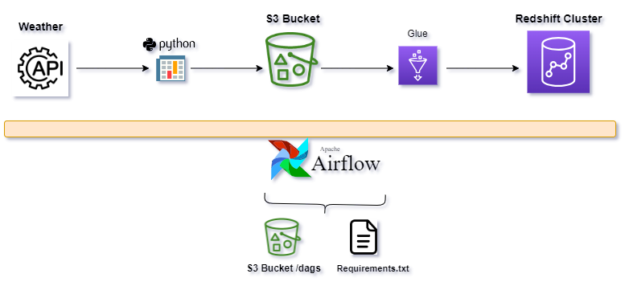

# 🌦️ End-to-End Weather Data Ingestion Pipeline

An automated ETL pipeline built using **Apache Airflow** and **AWS services** to extract, transform, and load weather data from the [OpenWeather API](https://openweathermap.org/api) into an **Amazon Redshift** data warehouse for analysis and insight generation.

## 🚀 Overview

This project automates the process of fetching weather data for a specific region (Indianapolis, US), transforms it, and stores it in an AWS Redshift data warehouse using a CI/CD pipeline. Key AWS services involved include:

- **S3** (for CSV storage)
- **Glue** (for data transformation)
- **Redshift** (for analytics)
- **CodeBuild** (for deployment)
- **IAM** (for security/permissions)
- **Airflow** (as the workflow orchestrator)

## 🛠️ Technologies Used

- **Languages & Libraries:** Python, SQL, Pandas, PySpark
- **Workflow Orchestration:** Apache Airflow
- **ETL/Transformation:** AWS Glue
- **Data Lake & Warehousing:** Amazon S3, Redshift
- **CI/CD:** AWS CodeBuild
- **Permissions & Roles:** IAM (for cross-service access)

## ⚙️ Pipeline Architecture

### 1. **Data Extraction (Airflow DAG)**
- Uses OpenWeather API (`/forecast` endpoint) to pull 5-day forecast data for **Indianapolis, US**.
- Flattens the JSON response using `pandas.json_normalize()` and stores it as a CSV.
- Uploads the CSV to an S3 bucket: `s3://gds-weather-data/date=<execution_date>/weather_api_data.csv`.

### 2. **Trigger Transformation DAG**
- Once the CSV is uploaded, a second DAG (`transform_redshift_dag`) is triggered.

### 3. **Data Transformation (Glue Job)**
- Glue job reads the CSV from S3.
- Schema is mapped and transformed using `ApplyMapping`.
- Transformed data is written into **Redshift** into table: `public.weather_data`.
- Table is dropped and recreated to ensure fresh data ingestion.

### 4. **CI/CD (CodeBuild + S3)**
- `buildspec.yml` handles the automatic upload of DAGs, Glue scripts, and requirement files to appropriate S3 locations.

## Example Analysis Use Cases
Once data is loaded into Redshift, you can query for insights such as:
- Temperature trends over 5 days
- Daily highs/lows and humidity levels
- Wind speed forecasts and visibility analysis
